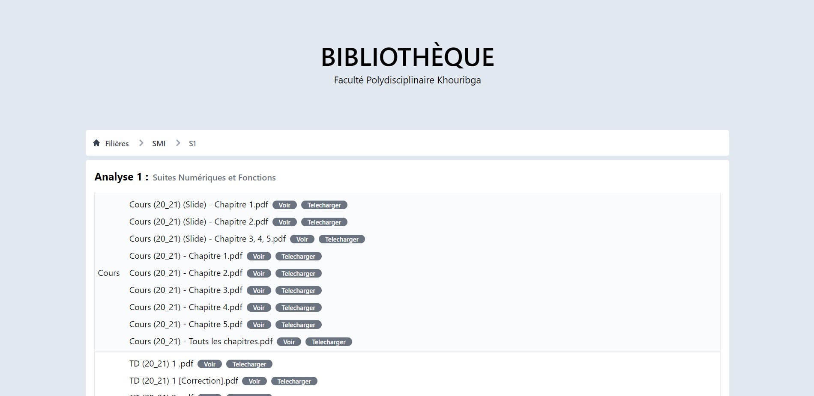

# FPK Bibliothèque


A website that contains a collection of courses, tutorials, projects and exams from **Faculté Polydisciplinaire Khouribga**'s lectures, divided and arranged by major, semester and subject.


Website : [fpk-biblio.netlify.app](http://fpk-biblio.netlify.app/)

CSS framework : ```TailwindCSS ```

<br/>

# Code structure

### Subjects
```html
<!-- Module -->
<div class="module sm:rounded p-4 my-2 bg-white">
    <!-- Module name -->
    <div id="lt1" class="text-xl font-bold pb-4">[SUBJECT NAME] :
        <small class="pl-2 font-semibold text-gray-500">[EXTRA TITLE]</small>
    </div>
    <table class="w-full border border-gray-200">
        <tbody>

            <tr class="odd:bg-gray-50 border-b border-gray-200 last:border-b-0">
                <!-- Document Type -->
                <td class="px-1 whitespace-nowrap text-center  font-normal">[DOCUMENTS TYPE : Cours, TDs, TPs, Devoirs, Controles, Exams, Autres]</th>
                <!-- Corresponding Documents -->
                <td class="px-3 py-2 w-full font-normal text-left">
                    <ul class="space-y-2">
                        [LIST OF FILES]
                    </ul>
                </th>
            </tr>

        </tbody>
    </table>
</div>
```

<br/>

### Files
```html
<!-- Fichier -->
<li>FILENAME(short version).FORMAT
    <a href=" [LINK TO THE FILE] " class="ml-2 px-3 text-xs font-medium text-center text-white bg-gray-500 rounded-lg hover:bg-gray-700">Voir</a>
    <a download=" [FULL FILENAME when downloaded] " href=" [LINK TO THE FILE] " class="ml-2 px-3 text-xs font-medium text-center text-white bg-gray-500 rounded-lg hover:bg-gray-700">Telecharger</a>
</li>
```